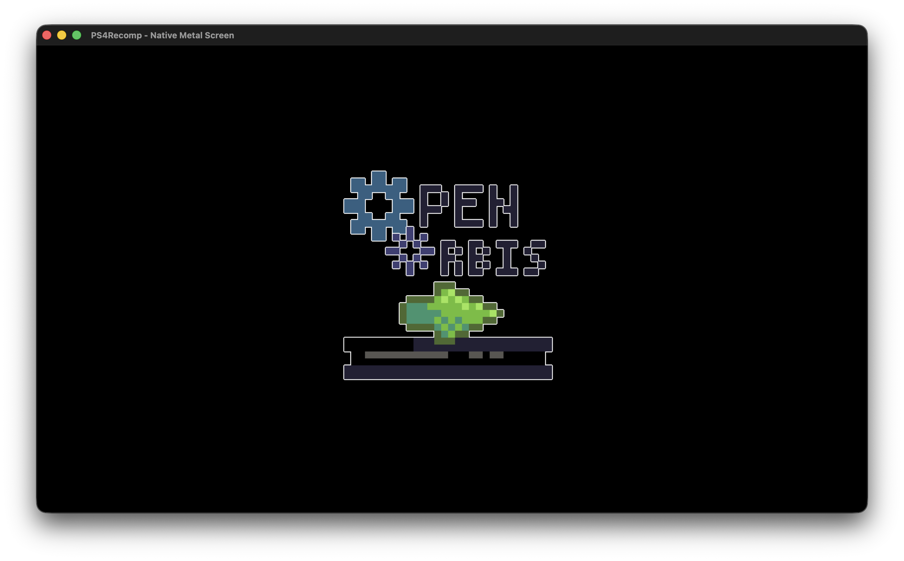

# PS4Recomp

A static ahead-of-time (AOT) recompiler translating PlayStation 4 (x86-64 ELF) binaries into native Apple Silicon (ARM64 macOS) executables without JIT compilation, virtual machines, or MoltenVK overhead.



---

## Features

- **Ahead-of-Time C Emitter & Compiler**: Recovers functions, CFG basic blocks, jump tables, and DWARF unwinding tables (`.eh_frame`), translating AMD64 instructions into partitioned C for fast, parallel Apple Clang compilation.
- **Direct Apple Metal Presentation**: Native `MTLPixelFormatBGRA8Unorm` rendering pipeline with hardware VSync via `CAMetalLayer` and PS4 direct video memory (UMA).
- **macOS App Bundling**: Automatically packages recompiled executables into standalone `.app` bundles with resources, icons, and clean window lifecycles (<kbd>Cmd</kbd>+<kbd>Q</kbd> / <kbd>Cmd</kbd>+<kbd>W</kbd>).
- **Orbis Kernel & POSIX Subsystems**:
  - **Memory & UMA**: Direct video memory allocation (`sceKernelAllocateDirectMemory`, `sceKernelMapDirectMemory`), virtual extents (`mmap`, `munmap`, `madvise`).
  - **Threading & Synchronization**: Full Orbis & POSIX threads (`scePthread*`), recursive mutexes, condition variables, reader-writer locks (`scePthreadRwlock*`), semaphores, and event flags.
  - **Event Queues (`sceKernelCreateEqueue`)**: Hardware flip and vblank event integration.
  - **Networking & BSD Sockets**: Sony `libSceNet` (`sceNet*`) and standard BSD socket APIs (`socket`, `bind`, `connect`, `listen`, `accept`, `send`, `recv`, `setsockopt`, `epoll`).
  - **I/O & Syscalls**: VFS path virtualization (`/app0`), 64-bit FreeBSD syscall shims (`fstat`, `unlink`, `poll`, `ioctl`, `getdirentries64`).
- **Media & Hardware Inputs**:
  - `libSceAudioOut`: Low-latency PCM streaming via macOS `AudioToolbox`.
  - `libScePad` & `libSceKeyboard`: Native DualSense/DualShock 4 via `GameController.framework` and keyboard fallback.
  - `libSceMsgDialog`: Native Cocoa modal dialogs with headless fallback.
  - `libSceNpTrophy`: Local trophy lifecycle tracking and notifications.
- **Companion PRX Linking**: Automatically discovers and links companion PRX modules in `sce_module/` and `prx/`, resolving thousands of guest dynamic library imports statically.
- **PS4 PKG Tooling**: Integrated Sony `\x7fCNT` PKG inspector and extractor (`eboot.bin`, PRX modules, PFS files).

---

## Quick Start

### Prerequisites

- macOS on Apple Silicon (ARM64)
- Go 1.22+
- Xcode Command Line Tools (`clang`)
- FreeType 2 (`brew install freetype`)

### Building the Tool

```bash
git clone https://github.com/vladislavkalinkin/PS4Recomp.git
cd PS4Recomp
go build -o ps4-recomp ./cmd/ps4-recomp
```

---

## Usage Guide

### 1. Analyze a Binary

Inspect instruction coverage, reachable functions, unwind data, and HLE imports:

```bash
./ps4-recomp analyze path/to/eboot.bin
```

This scans reachable CFGs, discovers companion PRX modules in adjacent `sce_module/` or `prx/` folders, and reports instruction compatibility alongside host shims, linked PRXs, and unresolved Sony NIDs.

### 2. Recompile an Application

Recompile an ELF/PRX to a native macOS `.app` bundle:

```bash
# Recompile and generate source files only
./ps4-recomp game.elf -o output_dir

# Recompile and build native ARM64 binary (-c)
./ps4-recomp game.elf -o output_dir -c

# Recompile, compile, and execute with a 5-second watchdog (-r -t 5)
./ps4-recomp game.elf -o output_dir -c -r -t 5

# Specify application root directory for /app0 VFS assets and PRXs
./ps4-recomp game.elf --app-dir /path/to/extracted/game -o output_dir -c

# Package standalone macOS .app bundle with all extracted game assets inside Resources/
./ps4-recomp game.elf --app-dir /path/to/extracted/game --copy-resources -o output_dir -c
```

### 3. Inspect and Extract PS4 PKG Packages

Manage retail and homebrew `.pkg` files directly:

```bash
# View package metadata (Title ID, version, category)
./ps4-recomp pkg info game.pkg

# List files inside a PKG container
./ps4-recomp pkg list game.pkg

# Extract eboot.bin, PRXs, and system metadata
./ps4-recomp pkg extract game.pkg -o extracted/

# Extract all game assets and filesystem resources
./ps4-recomp pkg extract game.pkg -o extracted/ --all
```

---

## Commercial Game Milestones

### Hogwarts Legacy (Unreal Engine 4)

PS4Recomp is being actively validated against large-scale commercial PlayStation 4 titles on Apple Silicon, including **Hogwarts Legacy Deluxe Edition (CUSA12771)**. The static recompiler successfully parses and lifts the 312 MB guest binary and all companion PRX modules, initializes UMA unified direct memory, configures custom allocators via `SceLibcParam`, executes `_start`, and drives deep into Unreal Engine 4's core subsystem initialization:

```text
[ps4-recomp] Initializing runtime...
[ps4-recomp] Loading guest memory image (312811520 bytes), allocated dynamic address space (524288.0 MB)
[ps4-recomp] Initializing custom memory allocator via SceLibcParam at 0x4188230...
[ps4-recomp] Executing _start (0xf9a50)...
[ps4-recomp] WARN: Called unresolved function at RIP=0x96f3810 (RSP=0x7ffffef20)
[ps4-recomp] WARN: Called unresolved function at RIP=0x96f3810 (RSP=0x7ffffef30)

sceKernelMemoryPoolCommit failed with error code 0xffffffea. (Original Type: CPU, Type: CPU, Size: 0, Alignment: 65536)

PS4 OOM: CPU 0.00 MB, Garlic 00000.00 MB, Onion 00000.00 MB, FrameBuffer 00000.00 MB, OnionDirect 00000.00 MB, Flexible 00000.00 MB
LowLevelFatalError [File:Unknown] [Line: 197]
Ran out of memory allocating 0 bytes with alignment 65536

FATAL: Unresolved indirect jump/call to 0x0 (from RIP=0x0)
Registers:
  RAX=0x0000000000000000 RBX=0x0000000000000000 RCX=0x0000001001074d54 RDX=0x0000000000000005
  RSI=0x00000007ffffe908 RDI=0x0000000000000000 RBP=0x00000007ffffeb38 RSP=0x00000007ffffe820
  R8 =0x000000000b2cb660 R9 =0x0000000000000000 R10=0x0000000000000015 R11=0x0000000000000040
  R12=0x00000007ffffe908 R13=0x0000001001074d54 R14=0x000000000710f35a R15=0x0000000000000000
```

The runtime includes an informative diagnostic layer for unresolved imports and indirect jump dispatching, reporting symbol names, NIDs, calling libraries, and guest stack heuristics.

---

## Verification Test Suite

Run unit tests and end-to-end integration validations:

```bash
# Run all Go package unit tests
go test ./...

# Run the end-to-end POSIX, BSD Sockets & libkernel validation test:
cd tests/posix_net_test
# (Recompilation test validates I/O, rwlocks, and TCP loopback client/server)
./recomp_out/posix_net_test.app/Contents/MacOS/posix_net_test
```

---

## Project Structure

```text
├── cmd/ps4-recomp/          # CLI command-line entry point
├── pkg/
│   ├── analyzer/            # Static instruction coverage & CFG analyzer
│   ├── cli/                 # CLI driver, workflow orchestration, .app packager
│   ├── disasm/              # Disassembly, jump tables, dead flag elimination (DFE)
│   ├── elfloader/           # ELF64 / PRX loader, relocations, companion discovery
│   ├── emitter/             # Partitioned C emitter, HLE report, Clang driver
│   ├── lifter/              # AMD64 to C lifter (ALU, SIMD, AVX/VEX, FPU)
│   ├── ps4pkg/              # Sony PKG container & SFO metadata parser
│   └── runtime/             # Native macOS host runtime & kernel ABI
│       ├── core/            # Dynamic dispatch, guest context, register state
│       ├── kernel/          # Syscalls, UMA direct memory, threads, equeues, VFS
│       └── modules/         # libSceVideoOut, AudioOut, Net, Pad, Dialog, Trophy
└── tests/                   # Regression and integration test suites
```

---

## Acknowledgements & Credits

We would like to express our deep gratitude and appreciation to the open-source PlayStation emulation and homebrew research communities whose groundbreaking work and documentation made this static recompiler possible:

- **[OpenOrbis](https://github.com/OpenOrbis)**: For pioneering the open-source PS4 toolchain, header definitions, and system service reverse engineering.
- **[shadPS4](https://github.com/shadps4-emu/shadPS4)**: For their exceptional open-source PS4 emulator codebase, precise structure layouts, HLE module architectures, and invaluable documentation of Orbis system behaviors.
- **The PlayStation NID Database Contributors**: For compiling and maintaining comprehensive symbol dictionaries and NID-to-name mappings across PlayStation 4 system libraries.

---

## License

GPL-2.0. See [LICENSE](LICENSE) for details.
