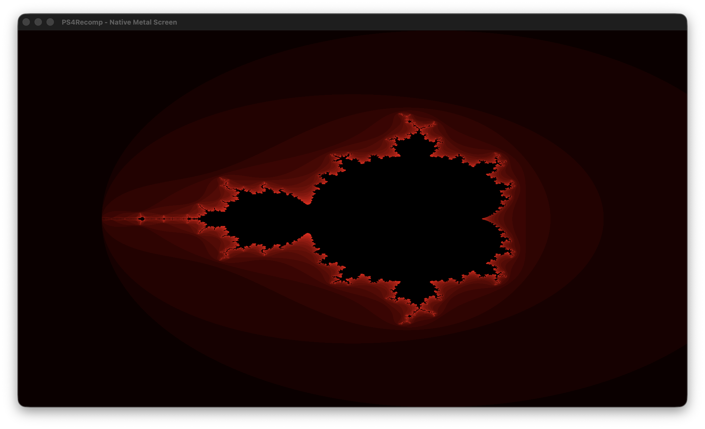

# PS4Recomp

A static ahead-of-time (AOT) recompiler that translates PlayStation 4 (x86-64 ELF) binaries into native Apple Silicon (ARM64 macOS) executables without JIT compilation, virtual machines, or MoltenVK overhead.



```text
===================================================================
  PS4Recomp: PlayStation 4 x86-64 to Native ARM64 AOT Recompiler
===================================================================
[ps4-recomp] [1/4] Loading ELF: tools/OpenOrbis/PS4Toolchain/samples/graphics/graphics/x64/Debug/graphics.elf
             Entry point: 0xcb238 | Segments: 4 | Relocations: 3057 | Time: 6ms
[ps4-recomp] [2/4] Analyzing CFG and discovering reachable code...
             Discovered 5264 functions, 29181 basic blocks, 207565 instructions | Time: 140ms
[ps4-recomp] [3/4] Emitting C source files to 'output_graphics/'...
             Emitted 32 C source files | Time: 332ms
[ps4-recomp] [4/4] Compiling native ARM64 binary with clang (-O2, 8 workers)...
             Compiled binary: output_graphics/ps4_app | Time: 33.72s
[ps4-recomp] All tasks completed successfully in 34.198s
===================================================================
[ps4-recomp] Running output_graphics/ps4_app (watchdog timeout: 4s)...
[ps4-recomp] Initializing runtime...
[ps4-recomp] Loading guest memory image (1277952 bytes), allocated dynamic address space (1090.0 MB)
[ps4-recomp] Executing _start (0xcb238)...
main: Creating a scene
main: Entering draw loop...
[videoout] Presenting frame 0 (buffer 0, 1920x1080)
[videoout] Presenting frame 1 (buffer 1, 1920x1080)
[videoout] Presenting frame 2 (buffer 0, 1920x1080)
[ps4-recomp] Watchdog timeout of 4s reached. Terminated cleanly.
```

---

## Overview

The recompiler statically parses guest PlayStation 4 x86-64 ELF binaries, recovers complete control flow graphs (CFGs) and function boundaries, lifts AMD64/SIMD/AVX instructions into clean C code, and compiles the result into a native Mach-O executable using Apple Clang.

The graphics and kernel subsystems are architected natively from first principles: direct Apple Silicon Metal rendering with zero Vulkan/MoltenVK translation layers, unified memory architecture (UMA) emulation for PS4 direct video memory, and hardware VSync synchronization via native event queues.

### Key Architectural Components

- **Direct Apple Silicon Metal Presentation (`pkg/runtime/ps4_metal_screen.m`)**:
  - High-performance native macOS windowing (`NSWindow`) and display layer (`CAMetalLayer`).
  - Zero-copy pixel presentation pipeline using `MTLCommandQueue` and blit encoding.
  - Built from the ground up to seamlessly scale from 2D framebuffers to heavy 3D rendering pipelines (Unreal Engine 4) without architectural rewrites.
- **Direct Video Memory Manager (`pkg/runtime/ps4_direct_mem.c`)**:
  - Simulates the PS4 Unified Memory Architecture (UMA) direct physical memory space.
  - Implements physical block allocation (`sceKernelAllocateDirectMemory`, `sceKernelGetDirectMemorySize`, `sceKernelReleaseDirectMemory`).
  - Page-aligned guest virtual mapping (`sceKernelMapDirectMemory`) backed by the recompiler's unified address space.
- **Display Output & VideoOut Subsystem (`pkg/runtime/ps4_videoout.c`)**:
  - Full `libSceVideoOut.so` implementation (`sceVideoOutOpen`, `sceVideoOutSetBufferAttribute`, `sceVideoOutRegisterBuffers`, `sceVideoOutSetFlipRate`, `sceVideoOutAddFlipEvent`, `sceVideoOutSubmitFlip`, `sceVideoOutGetFlipStatus`).
  - Double and multi-buffering with hardware-synchronized flip events.
- **Event Queue Subsystem (`pkg/runtime/ps4_equeue.c`)**:
  - Native kernel event queue mechanism (`sceKernelCreateEqueue`, `sceKernelDeleteEqueue`, `sceKernelWaitEqueue`).
  - Condition-variable event signaling with support for `ORBIS_KERNEL_EVFILT_VIDEO_OUT` and timed waits.
- **ELF Loader (`pkg/elfloader`)**: Loads ELF segments into a contiguous guest memory image, extracts static and dynamic symbols, parses `.init_array`, and processes ELF64 relocations (`.rela.dyn` and `.rela.plt`).
- **Disassembler & CFG (`pkg/disasm`)**: Recovers functions, basic blocks, indirect jump tables from `.rodata`, and performs backward flag liveness analysis for dead flag elimination (DFE).
- **Instruction Lifter (`pkg/lifter`)**: Modular instruction lifter translating x86-64 instructions into clean C:
  - **100% instruction coverage verified across all 17 OpenOrbis SDK samples** (>500,000 instructions):
  - `alu.go`: Integer arithmetic, logic, bit manipulation (`BSWAP`, `BT`, `BTS`, `BTR`, `BTC`, `POPCNT`, `LZCNT`, `TZCNT`, `SHLD`, `SHRD`), CPU feature discovery (`CPUID`, `XGETBV`), and atomic hardware synchronization (`LOCK XADD`, `CMPXCHG`).
  - `simd.go`: Packed SIMD arithmetic (`PSUB*`, `PMULLW`, `PMULHW`, `PMADDWD`), packing/unpacking (`PACK*`, `PUNPCK*`), element insertion/shuffling (`PINSR*`, `PSHUF*`), vector shifts (`PSLL*`, `PSRL*`, `PSRA*`), scalar/packed floats (`ADDSD`, `MULSD`, `COMISD`, `COMISS`, `MINSD`, `MAXSD`, `SQRTSS`, `SQRTSD`), and comprehensive 2/3/4-operand **AVX/VEX** instruction support.
  - `fpu.go`: IEEE 754 80-bit x87 FPU stack emulation with hardware status/control words.
  - `control_flow.go`: Branch prediction hints, condition code evaluation, and DWARF exception recovery.
  - `lifter.go`: Core instruction dispatch loop, opcode support registry, and operand decode/read/write primitives.
- **Exception Handling & Unwinding (`pkg/runtime` & `pkg/emitter`)**:
  - Full C++ exception handling (`try`, `catch`, `throw`) support without JIT.
  - Guest `libunwind` and `libcxxabi` execute natively to parse DWARF `.eh_frame` unwind tables and locate landing pads.
  - Functions that can throw or catch register lightweight `_setjmp`/`_longjmp` unwind frames (`UnwindFrame`).
  - Low-level resume points (`Registers_x86_64::jumpto` / `unw_resume`) transfer control to the enclosing landing pad with proper stack pointer restoration (`RSP += 8`), adhering to System V AMD64 ABI conventions.
- **Multi-Threading & Synchronization (`pkg/runtime/ps4_threading.c` & `pkg/runtime/ps4_sync.c`)**:
  - Full POSIX and Orbis multi-threading runtime support with dedicated 4 MB stacks per guest thread.
  - Thread lifecycle management (`pthread_create`, `pthread_join`, `pthread_detach`, `pthread_self`, `pthread_equal`).
  - Dynamic TLS key support (`pthread_key_create`, `pthread_setspecific`, `pthread_getspecific`).
  - Synchronization primitives: hash-table mutex map with recursive mutex support, condition variables (`wait`, `timedwait`, `signal`, `broadcast`), reader-writer locks, and thread-safe one-time initialization (`pthread_once`).
- **Virtual Memory Extent Allocator (`pkg/runtime/recomp_runtime.c`)**:
  - Extent-based virtual memory manager for guest `mmap`, `munmap`, and `madvise`.
  - Page-aligned allocations, best-fit search, extent splitting, bidirectional coalescing on free, and physical host page purging via `madvise(MADV_DONTNEED)`.
- **System Call & Kernel ABI (`pkg/runtime/ps4_syscalls.c`)**:
  - Genuine implementations replacing stubs:
    - `fstat`: Full 128-byte FreeBSD 64-bit `struct ps4_stat` translation (`st_dev`, `st_ino`, `st_mode`, `st_nlink`, `st_uid`, `st_gid`, `st_rdev`, timestamps, `st_size`, `st_blocks`, `st_blksize`).
    - `poll`: Direct translation of `struct pollfd` arrays forwarded to host `poll()`.
    - `ioctl`: Kernel request forwarding with proper error propagation.
    - `raise` & `sigprocmask`: Direct POSIX signal raising and 128-bit `sigset_t` translation.
    - Strict `errno` synchronization: All failing syscalls and shims sync `errno` directly to guest TLS (`ctx->fs_base + 0x100`).
    - Unknown syscalls strictly return `-1` with `errno = ENOSYS`.
- **Optimized C Emitter (`pkg/emitter`)**:
  - Emits partitioned C source files for multi-threaded Clang compilation.
  - **Fast-path function entry**: Direct fallthrough on normal function entry (`ctx->rip == addr`), bypassing basic block switches.
  - **Selective unwinding**: Leaf functions skip `UnwindFrame` and `_setjmp` overhead completely.
  - **Optimized flag computation**: Hot integer ALU operations prune auxiliary (`af`) and parity (`pf`) calculations.

---

## Prerequisites

- macOS running on Apple Silicon (ARM64)
- Go 1.21 or newer
- Xcode Command Line Tools (`clang`)

---

## Building and Running

### 1. Run Unit Tests and Static Analysis

```bash
go test -v ./...
golangci-lint run --no-config ./...
```

### 2. Recompile and Run Sample Binaries

You can build and run binaries using the CLI with built-in execution (`-r`) and watchdog timeout (`-t <seconds>`):

#### A. Interactive 2D Metal Graphics (`graphics.elf`)
Renders a high-resolution Mandelbrot fractal directly onto a native macOS Metal window using PS4 direct video memory, double buffering, and flip event synchronization:

```bash
# Recompile and run with a 4-second watchdog timer:
go run . tools/OpenOrbis/PS4Toolchain/samples/graphics/graphics/x64/Debug/graphics.elf -o output_graphics -r -t 4
```

#### B. Hello World (`hello_world.elf`)
Basic runtime initializers, stdout writing, and microsecond sleep:

```bash
# Recompile and run with 3-second watchdog:
go run . hello_world.elf -o output_hello -r -t 3
```

Output:
```text
===================================================================
  PS4Recomp: PlayStation 4 x86-64 to Native ARM64 AOT Recompiler
===================================================================
[ps4-recomp] [1/4] Loading ELF: hello_world.elf
             Entry point: 0xb0b88 | Segments: 4 | Relocations: 3039
[ps4-recomp] [2/4] Analyzing CFG and discovering reachable code...
             Discovered 5008 functions, 26025 basic blocks, 181482 instructions
[ps4-recomp] [3/4] Emitting C source files to 'output_hello/'...
             Emitted 27 C source files
[ps4-recomp] [4/4] Compiling native ARM64 binary with clang (-O2, 8 workers)...
             Compiled binary: output_hello/ps4_app
[ps4-recomp] All tasks completed successfully
===================================================================
[ps4-recomp] Running output_hello/ps4_app (watchdog timeout: 3s)...
main: Hello world! Waiting 2 seconds!
main: Done. Infinitely looping...
[ps4-recomp] Watchdog timeout of 3s reached. Terminated cleanly.
```

#### C. C++ Exception Handling (`exceptions.elf`)
C++ `try`/`catch`/`throw`, DWARF `.eh_frame` table evaluation, and landing pad dispatch:

```bash
go run . exceptions.elf -o output_exc -r -t 3
```

Output:
```text
[ps4-recomp] Initializing runtime...
[ps4-recomp] Loading guest memory image (1277952 bytes), allocated dynamic address space (1090.0 MB)
[ps4-recomp] Executing _start (0xcb1c8)...
main: Before testcase...
testcase: Caught! The exception says: Catch me if you can. :p
main: .what() = Another one.
main: Testcase PASS
main: Infinite looping...
```

#### D. Multi-Threading & Synchronization (`tests/threading_test/threading_test.elf`)
Concurrent `std::thread` workers, `std::mutex`, atomic `LOCK XADD` (`fetch_add`), and thread joining:

```bash
go run . tests/threading_test/threading_test.elf -o output_thread -r -t 3
```

Output:
```text
[ps4-recomp] Initializing runtime...
[ps4-recomp] Loading guest memory image (630784 bytes), allocated dynamic address space (1090.0 MB)
[ps4-recomp] Executing _start (0x5a0f8)...
main: Starting multi-threading test...
main: Spawned worker threads, waiting for join...
Thread 1 started!
Thread 2 started!
Thread 1 finished its 50 iterations.
Thread 2 finished its 50 iterations.
main: Both threads joined. Final counter = 100 (expected 100)
main: Multi-threading test PASS
main: Done. Infinitely looping...
```

#### E. Memory & Computational Stress Test (`tests/memory_stress_test/memory_stress_test.elf`)
1,000,000 prime sieve, 128x128 matrix multiplication (2M ops), QuickSort on 50,000 integers, 5,000 container iterations, and 400MB extent churn & address reuse:

```bash
go run . tests/memory_stress_test/memory_stress_test.elf -o output_mem -r -t 5
```

Output:
```text
[ps4-recomp] Initializing runtime...
[ps4-recomp] Loading guest memory image (565248 bytes), allocated dynamic address space (1090.0 MB)
[ps4-recomp] Executing _start (0x50848)...
main: Starting Aggressive Memory & Loop Stress Test...
main: Running Sieve of Eratosthenes to 1,000,000...
main: Primes found = 78498 (expected 78498) -> OK
main: Running 128x128 Matrix Multiplication (2M operations)...
main: Matrix total sum = 4194304 (0.0, expected 4194304) -> OK
main: Running QuickSort on 50,000 64-bit integers...
main: QuickSort verification -> OK
main: Running 5,000 dynamic container allocation cycles...
main: Container churn verification -> OK
main: Running 400MB mmap/munmap virtual memory extent churn...
test_mmap_churn: Completed 100 cycles of 4MB (400 MB churn). Address reused 99 times!
main: VM extent reuse verification -> OK

main: All memory and loop stress tests PASSED!
main: Done. Infinitely looping...
```

---

## Verified OpenOrbis Sample Coverage

Automated test suite (`pkg/lifter/coverage_test.go`) validates **100.0% opcode coverage** across all built samples:

| Sample Binary | Instructions | Functions | Status |
| :--- | :--- | :--- | :--- |
| `graphics.elf` | 19,348 | 662 | **100.0%** (Verified Live on Metal) |
| `SDL2.elf` | 242,993 | 1,728 | **100.0%** (AVX / VEX instructions) |
| `input.elf` | 42,373 | 862 | **100.0%** |
| `pngdec.elf` | 41,322 | 839 | **100.0%** |
| `threading.elf` | 22,036 | 818 | **100.0%** |
| `keyboard.elf` | 21,103 | 686 | **100.0%** |
| `system.elf` | 20,011 | 674 | **100.0%** |
| `font.elf` | 19,727 | 665 | **100.0%** |
| `networking.elf` | 18,913 | 653 | **100.0%** |
| `exceptions.elf` | 18,699 | 650 | **100.0%** |
| `piglet.elf` | 18,537 | 644 | **100.0%** |
| `hello_world.elf` | 18,423 | 644 | **100.0%** |
| `audio-wav.elf` | 10,590 | 118 | **100.0%** |
| `net_http.elf` | 5,396 | 69 | **100.0%** |
| `trophies.elf` | 3,516 | 41 | **100.0%** |
| `dialogs.elf` | 3,422 | 42 | **100.0%** |
| `using_library.elf` | 3,352 | 40 | **100.0%** |

---

## Environment Configuration

You can customize the guest virtual address space size by setting `PS4_RECOMP_MEM`:

```bash
# Allocate 2 GB of guest virtual address space
PS4_RECOMP_MEM=2G perl -e 'alarm 4; exec "./output_graphics/ps4_app"'
```

---

## Project Structure

```text
├── cmd/
│   └── ps4-recomp/          # CLI tool entry point
├── images/
│   └── graphics_test_01.png # Native Metal 2D Mandelbrot output
├── pkg/
│   ├── cli/                 # Command-line driver, argument parser, watchdog and pipeline orchestrator
│   ├── disasm/              # Disassembly, CFG recovery, jump tables, and flag liveness analysis
│   ├── elfloader/           # ELF segment loader, symbol table parser, and relocation engine
│   ├── emitter/             # Partitioned C emission, shims, and parallel Clang build driver
│   ├── lifter/              # Modular x86-64 machine instruction lifter
│   │   ├── alu.go           # Integer ALU, shifts, bit tests, BSWAP, CPUID, atomic operations
│   │   ├── control_flow.go  # Branching, setcc, cmovcc, exception unwinding detection
│   │   ├── fpu.go           # x87 FPU stack emulation
│   │   ├── simd.go          # SSE/AVX vector moves, packed math, scalar/packed floats, VEX opcodes
│   │   └── lifter.go        # Core instruction dispatch loop and operand primitives
│   └── runtime/             # Native host runtime and PS4 kernel ABI
│       ├── recomp_runtime.h   # Guest context, SIMD unions, extent structs, and prototypes
│       ├── recomp_runtime.c   # Virtual memory extent manager, flat address space, runtime init
│       ├── ps4_metal_screen.h # Metal screen presentation header
│       ├── ps4_metal_screen.m # Native Apple Metal CAMetalLayer & NSWindow renderer
│       ├── ps4_direct_mem.h   # PS4 direct physical memory allocator header
│       ├── ps4_direct_mem.c   # Direct memory allocation and mapping (UMA)
│       ├── ps4_videoout.h     # libSceVideoOut API header
│       ├── ps4_videoout.c     # Video output, buffer registration, flip submission
│       ├── ps4_equeue.h       # Kernel event queue header
│       ├── ps4_equeue.c       # Event queue creation, waiting, and event posting
│       ├── ps4_syscalls.c     # POSIX syscalls, files, memory, and signals
│       ├── ps4_threading.c    # Guest thread lifecycle, stacks, TLS keys
│       └── ps4_sync.c         # Mutexes, condition variables, rwlocks, and pthread_once
├── tests/
│   ├── threading_test/      # Multi-threaded C++ testcase
│   └── memory_stress_test/  # Compute and virtual memory stress testcase
├── hello_world.elf          # Testcase 1: Standard I/O, usleep, global initializers
└── exceptions.elf           # Testcase 2: C++ throw/catch, DWARF unwinding, stringstream
```
