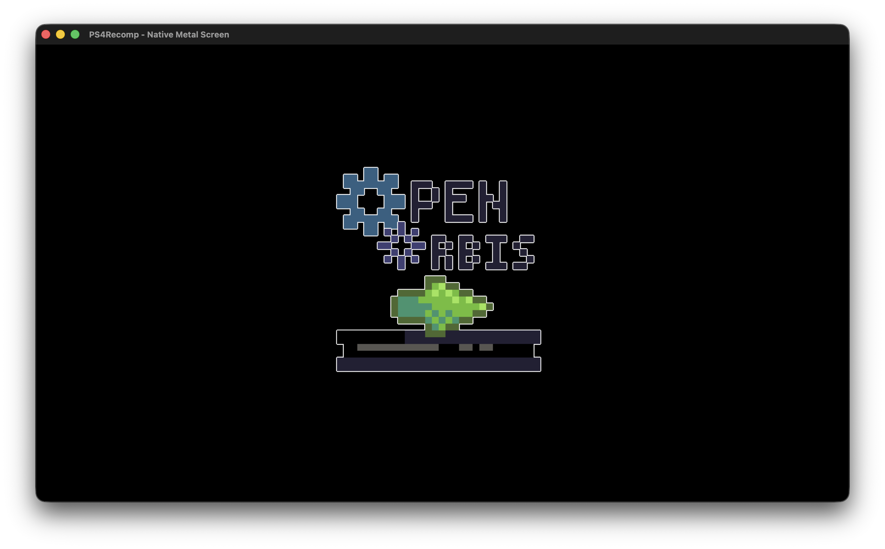

# PS4Recomp

A macOS Apple Silicon ahead-of-time (AOT) recompiler that translates PlayStation 4 (x86-64 ELF) binaries into native executables. No JIT, virtual machines, or MoltenVK required.



---

## Features

- **AOT C Compiler**: Recovers functions, CFG, and jump tables, translating AMD64 instructions into partitioned C for parallel Apple Clang compilation.
- **Native Metal Graphics**: Direct `MTLPixelFormatBGRA8Unorm` rendering pipeline with hardware VSync via `CAMetalLayer`.
- **Orbis & POSIX Subsystems**: Shims for memory (UMA), threads, sync, events, networking (`libSceNet`/BSD sockets), and VFS path virtualization (`/app0`).
- **Media & Hardware**: Low-latency PCM audio (`AudioToolbox`), DualSense/DS4 support (`GameController.framework`), and Cocoa modal dialogs.
- **Tooling & Bundling**: Static PRX module linking, and automatic macOS `.app` bundle generation.

---

## Quick Start

### Prerequisites

- macOS (Apple Silicon)
- Go 1.22+
- Xcode Command Line Tools (`clang`)
- FreeType 2 (`brew install freetype`)

### Prerequisites for Commercial Games

PS4Recomp operates **exclusively on already decrypted and extracted game folders** containing the game's executable (`eboot.bin`) and assets. It does not parse or decrypt proprietary encrypted package containers directly.

To dump and extract your legally purchased game backups on macOS, we officially recommend using the native, open-source community tool **[ps4-pkg-tools](https://github.com/xXJSONDeruloXx/ps4-pkg-tools)** (supports both CLI and GUI interfaces).

### Building

```bash
git clone https://github.com/vladislavkalinkin/PS4Recomp.git
cd PS4Recomp && go build -o ps4-recomp ./cmd/ps4-recomp
```

---

## Usage Guide

### 1. Analyze a Binary

Scan CFGs, discover companion PRXs, and report instruction compatibility for the decrypted executable:

```bash
./ps4-recomp analyze path/to/extracted_game/eboot.bin
```

### 2. Recompile to macOS `.app`

Recompile the extracted Orbis binaries and package them into a native standalone bundle:

```bash
# Basic compilation to native ARM64 binary
./ps4-recomp path/to/extracted_game/eboot.bin -o output_dir -c

# Full package with VFS assets and resources included into macOS app bundle
./ps4-recomp path/to/extracted_game/eboot.bin --app-dir /path/to/extracted_game --copy-resources -o output_dir -c
```

---

## Commercial Game Milestones

### Hollow Knight: Silksong (Unity 6)

```text
[ps4-recomp] Initializing runtime...
[ps4-recomp] Loading guest memory image (137105408 bytes), allocated dynamic address space (524288.0 MB)
[ps4-mem] SceLibcParam at 0x2000000: size=0xa8 ver=14.1 malloc_replace=0x20000f8 new_replace=0x2000170
[ps4-mem] SceLibcMallocReplace at 0x20000f8: size=0x78 init=0x14db270 malloc=0x14dba10
[ps4-recomp] Initializing custom memory allocator via SceLibcParam at 0x14db270...
[ps4-mem] sceKernelAllocateDirectMemory: start=0x0 end=0x800000000 len=268435456 (256.00 MB) align=2097152 type=0
[ps4-mem] sceKernelMapDirectMemory: in=0x0 len=268435456 (256.00 MB) prot=0x33 flags=0x0 phys=0x0 align=2097152
[ps4-vm] recomp_vm_alloc_named_aligned (direct_mem): size=268435456 (256.00 MB) align=2097152 flags=0x0
[ps4-vm] recomp_vm_alloc_named_aligned SUCCESS: addr=0x8400000
[ps4-mem] sceKernelMapDirectMemory SUCCESS: out=0x8400000
[ps4-mem] sceKernelSetVirtualRangeName: addr=0x8400000 len=268435456 name='dlmalloc_extra'
[ps4-recomp] Initializing libc malloc subsystem via _malloc_init at 0x2ca7a00...
[ps4-kernel] _sceKernelRtldSetApplicationHeapAPI: table at 0x2da4178
[ps4-kernel] heap_malloc=0x14dba10, heap_free=0x14db9b0
[ps4-vm] recomp_vm_alloc_named_aligned (heap_trace_info): size=4096 (0.00 MB) align=4096 flags=0x0
[ps4-vm] recomp_vm_alloc_named_aligned SUCCESS: addr=0x82f0000
[ps4-mem] sceKernelAllocateDirectMemory: start=0x0 end=0x800000000 len=268435456 (256.00 MB) align=2097152 type=0
[ps4-mem] sceKernelMapDirectMemory: in=0x0 len=268435456 (256.00 MB) prot=0x33 flags=0x0 phys=0x10000000 align=2097152
[ps4-vm] recomp_vm_alloc_named_aligned (direct_mem): size=268435456 (256.00 MB) align=2097152 flags=0x0
[ps4-vm] recomp_vm_alloc_named_aligned SUCCESS: addr=0x18400000
[ps4-mem] sceKernelMapDirectMemory SUCCESS: out=0x18400000
[ps4-mem] sceKernelSetVirtualRangeName: addr=0x18400000 len=268435456 name='dlmalloc_extra'
[ps4-recomp] Executing _start (0x13550)...
[ps4-mem] sceKernelReserveVirtualRange: in=0x0 len=1048576 (1.00 MB) flags=0x0 align=262144
[ps4-vm] recomp_vm_alloc_named_aligned (reserved): size=1048576 (1.00 MB) align=262144 flags=0x0
[ps4-vm] recomp_vm_alloc_named_aligned SUCCESS: addr=0x8300000
[ps4-mem] sceKernelReserveVirtualRange SUCCESS: out=0x8300000
FIOS2: built with SDK version 0x12508001
[ps4-vm] recomp_vm_alloc_named_aligned (anon): size=81920 (0.08 MB) align=4096 flags=0x0
[ps4-vm] recomp_vm_alloc_named_aligned SUCCESS: addr=0x28400000
[ps4-vm] recomp_vm_alloc_named_aligned (anon): size=147456 (0.14 MB) align=4096 flags=0x0
[ps4-vm] recomp_vm_alloc_named_aligned SUCCESS: addr=0x28414000
[ps4-vm] recomp_vm_alloc_named_aligned (anon): size=147456 (0.14 MB) align=4096 flags=0x0
[ps4-vm] recomp_vm_alloc_named_aligned SUCCESS: addr=0x28438000
Argument Count = 2Arg 0 = H?
                            H;M?uH??([]??P
                                          ??
                                            ??????UH??AWAVAUATSH??
Arg 1 =
********** LAUNCHER CONTROL ************************************
	File System Root = NONE SPECIFIED
	Launcher Path = NONE SPECIFIED
	Launcher Arguments NONE SPECIFIED
**********/LAUNCHER CONTROL ************************************
[ps4-recomp] sceKernelLoadStartModule: /app0/Media/Modules/PS4Util.prx
[ps4-recomp] sceKernelLoadStartModule: /app0/Media/Modules/Il2CppUserAssemblies.prx
[ps4-mem] sceKernelReserveVirtualRange: in=0x0 len=4194304 (4.00 MB) flags=0x0 align=262144
[ps4-vm] recomp_vm_alloc_named_aligned (reserved): size=4194304 (4.00 MB) align=262144 flags=0x0
[ps4-vm] recomp_vm_alloc_named_aligned SUCCESS: addr=0x28480000
[ps4-mem] sceKernelReserveVirtualRange SUCCESS: out=0x28480000
[ps4-mem] sceKernelReserveVirtualRange: in=0x0 len=16777216 (16.00 MB) flags=0x0 align=262144
[ps4-vm] recomp_vm_alloc_named_aligned (reserved): size=16777216 (16.00 MB) align=262144 flags=0x0
[ps4-vm] recomp_vm_alloc_named_aligned SUCCESS: addr=0x28880000
[ps4-mem] sceKernelReserveVirtualRange SUCCESS: out=0x28880000
[ps4-mem] sceKernelAllocateDirectMemory: start=0x0 end=0x800000000 len=2684354560 (2560.00 MB) align=2097152 type=3
[ps4-mem] sceKernelMapDirectMemory: in=0x0 len=2684354560 (2560.00 MB) prot=0x33 flags=0x0 phys=0x20000000 align=2097152
[ps4-vm] recomp_vm_alloc_named_aligned (direct_mem): size=2684354560 (2560.00 MB) align=2097152 flags=0x0
[ps4-vm] recomp_vm_alloc_named_aligned SUCCESS: addr=0x29a00000
[ps4-mem] sceKernelMapDirectMemory SUCCESS: out=0x29a00000
[ps4-mem] sceKernelReserveVirtualRange: in=0x0 len=8388608 (8.00 MB) flags=0x0 align=262144
[ps4-vm] recomp_vm_alloc_named_aligned (reserved): size=8388608 (8.00 MB) align=262144 flags=0x0
[ps4-vm] recomp_vm_alloc_named_aligned SUCCESS: addr=0xc9a00000
[ps4-mem] sceKernelReserveVirtualRange SUCCESS: out=0xc9a00000
[ps4-mem] sceKernelReserveVirtualRange: in=0x0 len=16777216 (16.00 MB) flags=0x0 align=262144
[ps4-vm] recomp_vm_alloc_named_aligned (reserved): size=16777216 (16.00 MB) align=262144 flags=0x0
[ps4-vm] recomp_vm_alloc_named_aligned SUCCESS: addr=0xca200000
[ps4-mem] sceKernelReserveVirtualRange SUCCESS: out=0xca200000
[ps4-vm] recomp_vm_alloc_named_aligned (anon): size=196608 (0.19 MB) align=4096 flags=0x0
[ps4-vm] recomp_vm_alloc_named_aligned SUCCESS: addr=0x29880000
[ps4-mem] sceKernelReserveVirtualRange: in=0x0 len=1048576 (1.00 MB) flags=0x0 align=262144
[ps4-vm] recomp_vm_alloc_named_aligned (reserved): size=1048576 (1.00 MB) align=262144 flags=0x0
[ps4-vm] recomp_vm_alloc_named_aligned SUCCESS: addr=0x298c0000
[ps4-mem] sceKernelReserveVirtualRange SUCCESS: out=0x298c0000
[ps4-mem] sceKernelReserveVirtualRange: in=0x0 len=262144 (0.25 MB) flags=0x0 align=262144
[ps4-vm] recomp_vm_alloc_named_aligned (reserved): size=262144 (0.25 MB) align=262144 flags=0x0
[ps4-vm] recomp_vm_alloc_named_aligned SUCCESS: addr=0x299c0000
[ps4-mem] sceKernelReserveVirtualRange SUCCESS: out=0x299c0000
[ps4-vm] recomp_vm_alloc_named_aligned (anon): size=196608 (0.19 MB) align=4096 flags=0x0
[ps4-vm] recomp_vm_alloc_named_aligned SUCCESS: addr=0xcb200000
[ps4-vm] recomp_vm_alloc_named_aligned (anon): size=196608 (0.19 MB) align=4096 flags=0x0
[ps4-vm] recomp_vm_alloc_named_aligned SUCCESS: addr=0xcb230000
[ps4-mem] sceKernelReserveVirtualRange: in=0x0 len=262144 (0.25 MB) flags=0x0 align=262144
[ps4-vm] recomp_vm_alloc_named_aligned (reserved): size=262144 (0.25 MB) align=262144 flags=0x0
[ps4-vm] recomp_vm_alloc_named_aligned SUCCESS: addr=0xcb280000
[ps4-mem] sceKernelReserveVirtualRange SUCCESS: out=0xcb280000
[ps4-vm] recomp_vm_alloc_named_aligned (anon): size=196608 (0.19 MB) align=4096 flags=0x0
[ps4-vm] recomp_vm_alloc_named_aligned SUCCESS: addr=0xcb2c0000
[ps4-vm] recomp_vm_alloc_named_aligned (anon): size=196608 (0.19 MB) align=4096 flags=0x0
[ps4-vm] recomp_vm_alloc_named_aligned SUCCESS: addr=0xcb2f0000
[ps4-mem] sceKernelReserveVirtualRange: in=0x0 len=262144 (0.25 MB) flags=0x0 align=262144
[ps4-vm] recomp_vm_alloc_named_aligned (reserved): size=262144 (0.25 MB) align=262144 flags=0x0
[ps4-vm] recomp_vm_alloc_named_aligned SUCCESS: addr=0xcb340000
[ps4-mem] sceKernelReserveVirtualRange SUCCESS: out=0xcb340000
[ps4-vm] recomp_vm_alloc_named_aligned (anon): size=196608 (0.19 MB) align=4096 flags=0x0
[ps4-vm] recomp_vm_alloc_named_aligned SUCCESS: addr=0xcb380000
[ps4-vm] recomp_vm_alloc_named_aligned (anon): size=81920 (0.08 MB) align=4096 flags=0x0
[ps4-vm] recomp_vm_alloc_named_aligned SUCCESS: addr=0xcb260000
[ps4-vm] recomp_vm_alloc_named_aligned (anon): size=81920 (0.08 MB) align=4096 flags=0x0
[ps4-vm] recomp_vm_alloc_named_aligned SUCCESS: addr=0xcb320000
[libil2cpp] sceAppContentInitialize returned 0x80d90003

*** stack smashing detected ***: terminated (caller=0x32a3710, rsp=0x7ffffa7c0, rbp=0x7ffffa888, r14=0x7ffffa8b8, *r14=0x2271e80, [rbp-0x30]=0x30ab256, rax=0x595e9fbd94fda766)
zsh: abort
```

### Hogwarts Legacy (Unreal Engine 4)

```text
[ps4-recomp] Initializing runtime...
[ps4-recomp] Loading guest memory image (312811520 bytes), allocated dynamic address space (524288.0 MB)
[ps4-recomp] Initializing custom memory allocator via SceLibcParam at 0x4188230...
[ps4-mem] sceKernelAllocateMainDirectMemory: len=67108864 (64.00 MB) align=65536 type=3
[ps4-mem] sceKernelAllocateDirectMemory: start=0x0 end=0xffffffffffffffff len=67108864 (64.00 MB) align=65536 type=3
[ps4-mem] sceKernelMapDirectMemory: in=0x4000000000 len=67108864 (64.00 MB) prot=0x32 flags=0x90 phys=0x0 align=0
[ps4-vm] recomp_vm_alloc_fixed (direct_mem): desired=0x4000000000 size=67108864 (64.00 MB)
[ps4-mem] sceKernelMapDirectMemory SUCCESS: out=0x4000000000
[ps4-mem] sceKernelMemoryPoolExpand: start=0x4000000 end=0x800000000 len=34292563968 (32703.94 MB) align=0
[ps4-mem] sceKernelAllocateDirectMemory: start=0x4000000 end=0x800000000 len=34292563968 (32703.94 MB) align=65536 type=3
[ps4-mem] sceKernelMemoryPoolReserve: in=0x1000000000 len=8589934592 (8192.00 MB) align=0 flags=0x90
[ps4-vm] recomp_vm_alloc_fixed (pool_reserved): desired=0x1000000000 size=8589934592 (8192.00 MB)
[ps4-mem] sceKernelMemoryPoolReserve SUCCESS: out=0x1000000000
[ps4-mem] sceKernelMemoryPoolReserve: in=0x2000000000 len=8589934592 (8192.00 MB) align=0 flags=0x90
[ps4-vm] recomp_vm_alloc_fixed (pool_reserved): desired=0x2000000000 size=8589934592 (8192.00 MB)
[ps4-mem] sceKernelMemoryPoolReserve SUCCESS: out=0x2000000000
[ps4-mem] sceKernelMemoryPoolReserve: in=0x3000000000 len=1073741824 (1024.00 MB) align=0 flags=0x90
[ps4-vm] recomp_vm_alloc_fixed (pool_reserved): desired=0x3000000000 size=1073741824 (1024.00 MB)
[ps4-mem] sceKernelMemoryPoolReserve SUCCESS: out=0x3000000000
[ps4-recomp] Executing _start (0xf9a50)...
GoodPGO
File root is /app0/!
[ps4-mem] sceKernelConfiguredFlexibleMemorySize: 4294967296 (4096.00 MB)
Used memory before allocating anything was 0.00MB
FIOS2: built with SDK version 0x09508001
[ps4-vm] recomp_vm_alloc_named_aligned (anon): size=81920 (0.08 MB) align=4096 flags=0x0
[ps4-vm] recomp_vm_alloc_named_aligned SUCCESS: addr=0x12a80000
[ps4-vm] recomp_vm_alloc_named_aligned (anon): size=147456 (0.14 MB) align=4096 flags=0x0
[ps4-vm] recomp_vm_alloc_named_aligned SUCCESS: addr=0x12a94000
[ps4-vm] recomp_vm_alloc_named_aligned (anon): size=147456 (0.14 MB) align=4096 flags=0x0
[ps4-vm] recomp_vm_alloc_named_aligned SUCCESS: addr=0x12ab8000

Failed to allocate virtual address space. (Original Type: CPU, Type: CPU, Size: 2943483904, Alignment: 65536)
[ps4-mem] sceKernelConfiguredFlexibleMemorySize: 4294967296 (4096.00 MB)
^C
```

---

## Project Structure

```text
├── cmd/ps4-recomp/      # CLI entry point
└── pkg/
    ├── analyzer/        # Instruction coverage & CFG analyzer
    ├── disasm/          # Disassembly & jump tables
    ├── elfloader/       # ELF64 / PRX loader & relocations
    ├── lifter/          # AMD64 to C lifter (ALU, SIMD, AVX, FPU)
    ├── emitter/         # Partitioned C emitter & Clang driver
    └── runtime/         # macOS host runtime & Orbis/POSIX kernel ABI
        ├── core/        # Guest context & register state
        └── modules/     # libSce (VideoOut, AudioOut, Net, Pad, etc.)
```

---

## Contributing Guidelines

- **Multi-platform support**: macOS Apple Silicon remains the main priority. Contributions for other platforms are welcome as long as they don't break or slow down macOS support.
- **AI Tooling**: Use of LLMs/AI for development is allowed, provided all generated code is thoroughly verified and does not break recompiled binary builds.

---

## Credits & Acknowledgements

Special thanks to the open-source PlayStation emulation and research communities:

- **[OpenOrbis](https://github.com/OpenOrbis)** — Open-source PS4 toolchain and reverse engineering.
- **[shadPS4](https://github.com/shadps4-emu/shadPS4)** — HLE module architecture and system behavior documentation.
- **[ps4libdoc](https://github.com/idc/ps4libdoc)** — Symbol dictionaries and NID-to-name mappings.

---

## Legal Notice

PS4Recomp is an independent educational and research project into ahead-of-time binary translation. It does not distribute, bundle, or contain any copyrighted PlayStation 4 system libraries, firmware files, or proprietary encryption keys. "PlayStation", "PlayStation 4", "PS4", and "Orbis OS" are registered trademarks of Sony Interactive Entertainment Inc. All commercial game titles and assets belong to their respective owners.

---

## License

[GPL-2.0](LICENSE)
